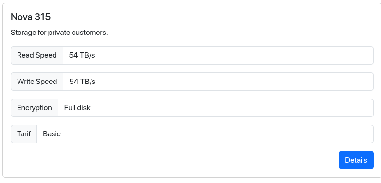
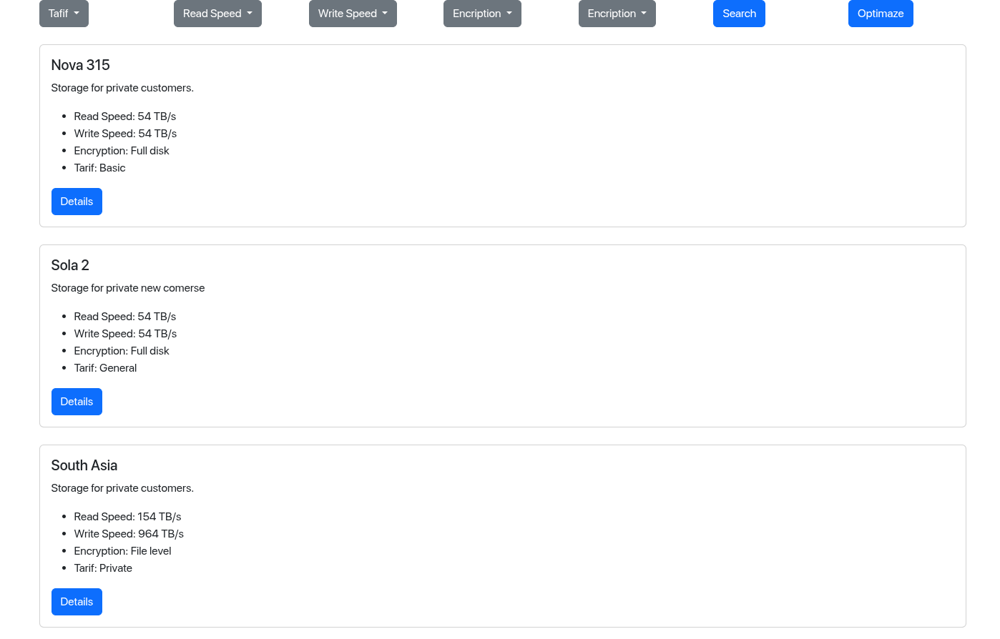

Учебный проект курса Kotlin Backend Developer. Поток курса 2025-11.

Catalog of storages - это компонент позволяющий пользователям брать в аренду
ресурсы для хранения цифровой информации и управлять ими. Задача компонента предоставить пользователю 
простой и удобный способ создания, изменения и удаления записей об арендованых мощностях.

1. Маркетинг и аналитика
    1. [Целевая аудитория](./docs/01-biz/01-target-audience.md)
    2. [Заинтересанты](./docs/01-biz/02-stakeholders.md)
    3. [Пользовательские истории](./docs/01-biz/03-bizreq.md)
2. Аналитика:
    1. [Функциональные требования](./docs/02-analysis/01-functional-requiremens.md)
    2. [Нефункциональные требования](./docs/02-analysis/02-nonfunctional-requirements.md)
3. Архитектура
    1. [ADR](docs/03-architecture/01-adrs.md)
    2. [Описание API](docs/03-architecture/02-api.md)
    3. [Архитектурные схемы](docs/03-architecture/03-arch.md